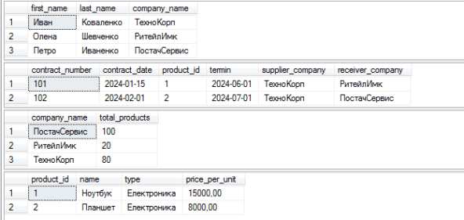

# Практична робота 1
---
Короткий опис
---
У цій лабораторній роботі було спроєктовано базу даних для моделювання виставки, створено структуру таблиць із відповідними обмеженнями, такими як первинні та зовнішні ключі. Реалізовано SQL-скрипти: SETUP.SQL для створення таблиць, INSERT.SQL для додавання початкових даних, UPDATE.SQL для оновлення інформації, DELETE.SQL для очищення та видалення таблиць. Також виконано перевірку результатів кожного етапу шляхом виведення вмісту таблиць до та після змін. У підсумку було автоматизовано основні операції з базою даних і забезпечено коректність її структури та даних.
---
**SETUP.SQL** 
---
Створені таблиці: 

1) Таблиця company_owner 
 

2) Таблиця company 
 

3) Таблиця company_owner_company 
 

4) Таблиця product 
 

5) Таблиця company_product 
 

6) Таблиця contract 
 

---
**INSERT.SQL** 
---
Занесена інформація в таблиці: 
 
 

---
**UPDATE.SQL** 
---
Змінена інформація в таблицях: 
 
 
---
**DELETE.SQL** 
---
Видалені таблиці: 
 
---
**QUERY.SQL** 
---
Обробка запитів: 
 